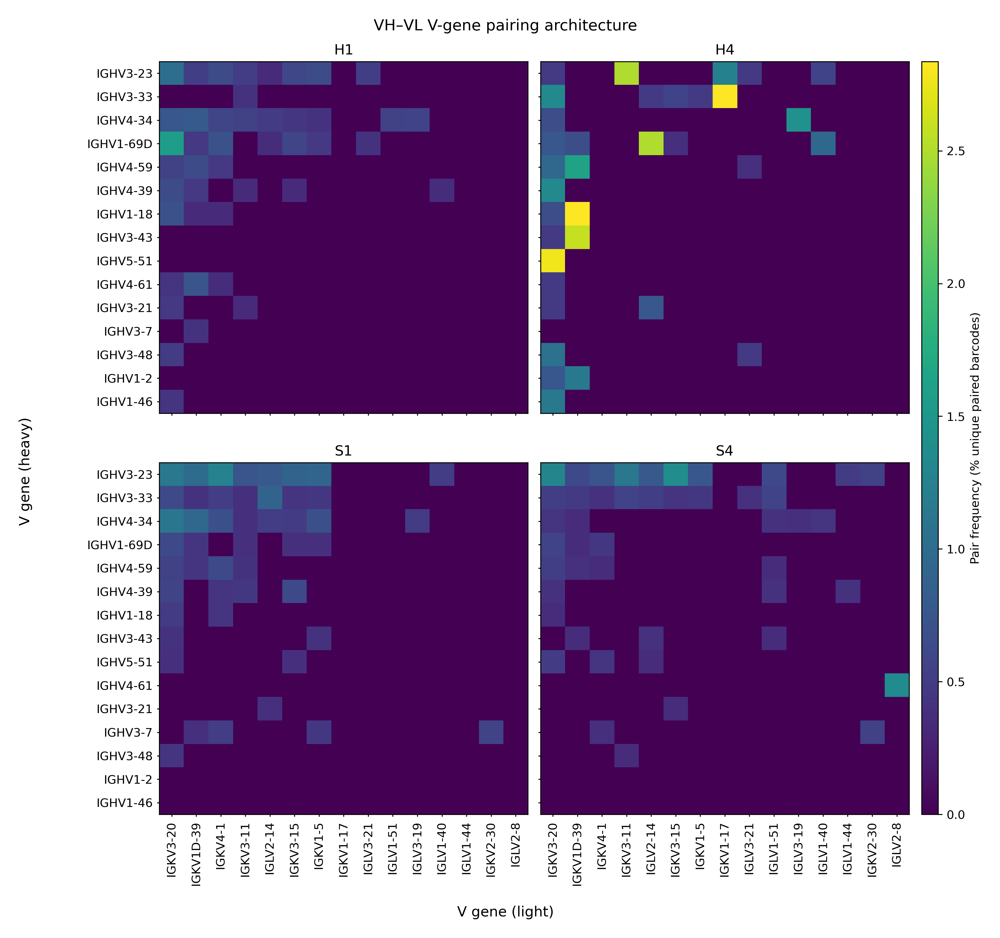

# Quantitative clonal architecture and somatic diversification in single-cell B cell repertoires during secondary dengue infection

## Integrated single-cell analysis of GEO dataset GSE288613 (Gonnella et al., 2025) combining 10x Genomics gene expression and VDJ sequencing

This repository presents an integrated single-cell analysis of B cell receptor repertoires across four samples (H1, H4, S1, S4) derived from the publicly available dataset GSE288613, originally generated by Gonnella et al. (Cell Host & Microbe, 2025). The framework combines de novo clonotype reconstruction, somatic hypermutation (SHM) quantification, V gene usage profiling, isotype distribution and CDR3 amino-acid length analysis within a transcriptionally resolved landscape.

Rather than treating repertoire features independently, the analysis situates clonal expansion and diversification within defined transcriptional states, enabling joint interpretation of transcriptional identity, mutation burden and clonal architecture.

Clonotype definitions were reconstructed de novo from IGH sequences extracted from 10x VDJ-B output using a distance-based clustering approach (DefineClones, ham model, length-normalised distance = 0.16). This provides a reproducible, method-controlled clonotyping framework independent of vendor-provided clonotype assignments.

Somatic hypermutation (SHM) rates were derived from IgBLAST AIRR output (outfmt 19) using the `v_identity` field under the IMGT domain system.

VH–VL pairing analysis was performed independently of clonotype reconstruction. Pairing information was extracted directly from 10x VDJ contig annotations at barcode level, allowing assessment of intra-clonal light chain diversity after IGH-based clone definition.

---

## Global transcriptional structure

The global UMAP embedding (`UMAP_group_H_vs_S.png`) shows substantial overlap between H and S groups. In this low-dimensional embedding, no clear condition-specific segregation is visually apparent.

When restricting the embedding to expanded clones (`UMAP_expanded.png`), expanded cells are distributed across multiple transcriptional states rather than confined to a single compartment.

Cluster-level marker structure (`Cluster_marker_panel_dotplot.png`) provides the transcriptional context used downstream for cluster-level expansion summaries.

---

## Somatic hypermutation (SHM)

SHM rates were derived from AIRR-formatted IgBLAST output using the reported `v_identity` field. Per-sample SHM distributions (`SHM_box_by_sample.png`) compare expanded versus non-expanded clones.

ECDF curves (`SHM_ecdf_by_sample.png`) provide a distribution-level view of expanded versus non-expanded SHM shifts.

The relationship between clone size and diversification is shown in `ALL.clone_size_vs_shm.scatter.png`.

---

## Isotype composition and V gene usage

Isotype distribution stratified by expansion state (`Isotype_usage_expanded.png`).

Top IGHV gene usage (`V_gene_usage_top15.png`).

---

## CDR3 architecture

IGH CDR3 amino-acid length distributions (`CDR3_len_IGH_violin.png`).

Cluster-resolved IGH CDR3 density (`CDR3_len_IGH_density_by_cluster.png`).

Light chain CDR3 density (`CDR3_len_light_density_by_cluster.png`).

---

## Cluster-level clonal expansion

Fraction of expanded cells per transcriptional cluster (`Cluster_expansion_fraction.png`).

Group-stratified cluster expansion (`Cluster_group_expansion.png`).

---

## VH–VL pairing architecture

VH–VL pairing was extracted from 10x VDJ contig annotations at barcode level and analysed within IGH-defined clones. This enables quantification of intra-clonal light chain diversity independent of heavy-chain lineage assignment.

Per-sample pairing tables are written to:

- `results/pairing/{sample}.vhvl_pairs.tsv`
- `results/metrics/{sample}.vhvl_pairing.summary.tsv`
- `results/metrics/{sample}.vhvl_vgene_pairs.top50.tsv`

---

## Quantitative results

The workflow writes key statistics into tabular outputs under `results/metrics/` and `results/clones/sweep/`.

---

### Expanded vs non-expanded SHM statistics

Computed from `results/metrics/shm_stats.summary.tsv`.

| sample | n_expanded | n_nonexpanded | median_expanded | median_nonexpanded | mean_expanded | mean_nonexpanded | p_mannwhitney | cliffs_delta_exp_vs_non |
|---|---:|---:|---:|---:|---:|---:|---:|---:|
| H1 | 243 | 4716 | 0.05034 | 0.0 | 0.057173744855967046 | 0.028826282866836278 | 9.148351813593164e-18 | 0.30349619716785864 |
| H4 | 267 | 663 | 0.0652899999999999 | 0.0341299999999999 | 0.0650419101123595 | 0.03656134238310706 | 5.646877881644038e-27 | 0.4459979324486925 |
| S1 | 1046 | 3092 | 0.021864999999999947 | 0.02027 | 0.0340629063097514 | 0.03280736093143593 | 0.38548041195841576 | 0.01747648282497978 |
| S4 | 246 | 3876 | 0.01022 | 0.0033799999999999 | 0.030509024390243885 | 0.02566334107327139 | 0.02274116716558188 | 0.0815818839302944 |

---

### Clone size vs SHM correlation

From `results/metrics/clone_size_vs_shm.spearman.tsv`.

| sample | n_clones | n_expanded_clones | rho_spearman_all | rho_spearman_expanded_only |
|---|---:|---:|---:|---:|
| H1 | 4827 | 111 | 0.08000544472768753 | 0.14894779361092197 |
| H4 | 733 | 70 | 0.19288172916928048 | 0.22385092211748842 |
| S1 | 3612 | 520 | 0.010401453680200755 | 0.040294550605541525 |
| S4 | 3988 | 112 | 0.026310425463175056 | -0.008625914402688548 |

---

### Zero vs non-zero pairing entropy comparison

From `results/metrics/zero_vs_nonzero_entropy_comparison.tsv`.

| sample | n_zero | n_nonzero | median_size_zero | median_size_nonzero | mannwhitney_p | rank_biserial_effect_size |
|---|---:|---:|---:|---:|---:|---:|
| H1 | 76 | 27 | 2.0 | 2.0 | 0.03791631403326313 | 0.13255360623781676 |
| H4 | 60 | 10 | 2.0 | 4.5 | 0.011039737189216704 | 0.4766666666666667 |
| S1 | 480 | 30 | 2.0 | 2.0 | 2.0742524585502161e-10 | 0.12916666666666665 |
| S4 | 90 | 19 | 2.0 | 2.0 | 0.04814737855537311 | 0.20175438596491224 |

---

### Clone pairing dominance summary

From `results/metrics/clone_pairing_dominance.correlations.tsv`.

Dominance (maximum VH–VL pair fraction) and entropy are mathematically coupled measures derived from the same within-clone categorical distribution. Consequently, a near-perfect negative correlation between dominance and entropy is expected and does not represent an independent biological association.

| sample | n_clones | min_clone_barcodes | median_clone_size_sequences | median_entropy_bits | median_dominant_pair_frac | spearman_rho_log10size_vs_dominance | pearson_r_log10size_vs_dominance | spearman_rho_log10size_vs_entropy | pearson_r_log10size_vs_entropy | spearman_rho_dominance_vs_entropy | pearson_r_dominance_vs_entropy |
|---|---:|---:|---:|---:|---:|---:|---:|---:|---:|---:|---:|
| H1 | 90 | 2 | 2.0 | 0.0 | 1.0 | -0.17702999713473158 | -0.0826704519110554 | 0.17749531451450484 | 0.20769067977801928 | -0.9998932479316787 | -0.9858672341230111 |
| H4 | 70 | 2 | 3.0 | 0.0 | 1.0 | -0.2830080208369339 | -0.12899339035742188 | 0.2830080208369339 | 0.2139576183115673 | -0.9999999999999999 | -0.9780577000858445 |
| S1 | 478 | 2 | 2.0 | 0.0 | 1.0 | -0.20953790491200638 | -0.17800145372100692 | 0.20953790491200638 | 0.20411439195822564 | -1.0 | -0.9975541902785423 |
| S4 | 100 | 2 | 2.0 | 0.0 | 1.0 | -0.1325851429230945 | -0.07554547326354989 | 0.1325851429230945 | 0.1380153900901822 | -1.0 | -0.9890468477955888 |

---

## Summary

Across all four samples, clonal expansion, SHM burden, isotype composition and V gene usage are represented within the transcriptional landscape. Expanded clones are distributed across multiple transcriptional states. Quantitative outputs summarise SHM differences between expanded and non-expanded clones, clone size–SHM associations, robustness of clone calling across distance thresholds, and VH–VL pairing architecture within IGH-defined lineages.

---

## Data provenance and references

### Primary dataset
Gonnella G et al.  
Immune profiling in subclinical secondary dengue-infected cases reveals adaptive immune signatures correlated to protection from severe dengue.  
*Cell Host & Microbe.* 2025.  
DOI: https://doi.org/10.1016/j.chom.2025.06.006

### GEO
GSE288613  
https://www.ncbi.nlm.nih.gov/geo/query/acc.cgi?acc=GSE288613

### Germline reference
IMGT/GENE-DB  
https://www.imgt.org/

### Repertoire profiling software
Bolotin, D. A., Poslavsky, S., Mitrophanov, I., Shugay, M., Mamedov, I. Z., Putintseva, E. V., & Chudakov, D. M. (2015). MiXCR: software for comprehensive adaptive immunity profiling. *Nature Methods*, 12(5), 380–381. https://doi.org/10.1038/nmeth.3364
  
Bolotin, D. A., Poslavsky, S., Davydov, A. N., Frenkel, F. E., Fanchi, L., Zolotareva, O. I., Hemmers, S., Putintseva, E. V., Obraztsova, A. S., Shugay, M., Ataullakhanov, R. I., Rudensky, A. Y., Schumacher, T. N., & Chudakov, D. M. (2017). Antigen receptor repertoire profiling from RNA-seq data. *Nature Biotechnology*, 35(10), 908–911. https://doi.org/10.1038/nbt.3979

MiXCR was used under an academic license obtained through Uppsala University.